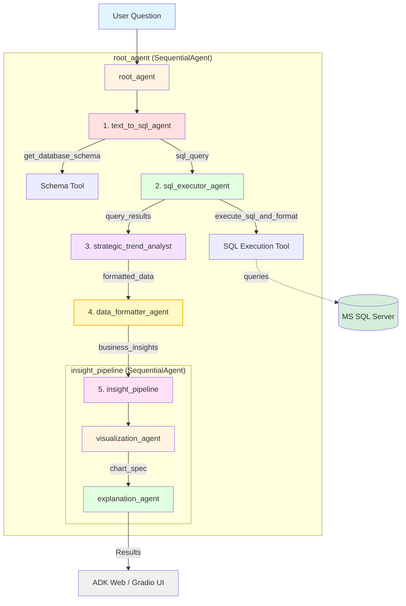

# 🤖 GBI Business Intelligence Agent

ระบบวิเคราะห์ข้อมูลอัจฉริยะสำหรับ **Global Bike Inc. (GBI)** ด้วย **Google ADK** และ **Gemini**

โปรเจกต์นี้เป็นการพัฒนาระบบ **Multi-Agent Business Intelligence (BI)** ที่แปลงคำถามภาษาธรรมดา (Natural Language) ให้กลายเป็นอินไซต์ทางธุรกิจที่นำไปใช้ได้จริง โดยออกแบบให้เอเจนต์หลายตัวทำงานร่วมกันอย่างเป็นลำดับผ่านเฟรมเวิร์ก **Google Agent Development Kit (ADK)**

---
## Architecture Overview


---

---

## 🚀 จุดเด่นของโปรเจกต์ (Key Features)

* **Sequential Multi-Agent Pipeline**
  การทำงานแบบส่งต่อหน้าที่อย่างเป็นระบบ 5 ขั้นตอน:
  **Text-to-SQL → SQL Executor → Data Formatter → Visualization → Explanation**

* **Strategic Trend Analyst**
  เอเจนต์วิเคราะห์แนวโน้มเชิงกลยุทธ์ เพื่อให้คำแนะนำด้านการขาย การบริหารสต็อก และการตัดสินใจทางธุรกิจ

* **Dual Interface**

  * **ADK Web UI**: สำหรับการตรวจสอบและ Debug การทำงานของเอเจนต์
  * **Gradio Web UI**: สำหรับผู้ใช้งานทั่วไป ใช้งานง่ายผ่านเว็บเบราว์เซอร์

* **Enterprise Security**

  * SQL Guardrails ป้องกันคำสั่งที่เป็นอันตราย
  * จัดการข้อมูลสำคัญผ่านไฟล์ `.env` เพื่อความปลอดภัย

---

## 🛠 สถาปัตยกรรมระบบ (System Architecture)

ระบบถูกออกแบบในรูปแบบ **SequentialAgent** โดยให้เอเจนต์แต่ละตัวรับผิดชอบหน้าที่เฉพาะทาง

1. **Text-to-SQL Agent**
   แปลงคำถามภาษาธรรมดาเป็นคำสั่ง SQL โดยอิงจาก Schema ของฐานข้อมูล

2. **SQL Executor Agent**
   ตรวจสอบความปลอดภัยและรันคำสั่ง SQL บนฐานข้อมูล **MS SQL Server (GBI)**

3. **Strategic Trend Analyst**
    เอเจนต์วิเคราะห์แนวโน้มเชิงกลยุทธ์ ทำหน้าที่ดึงอินไซต์จากข้อมูลเพื่อระบุโอกาสทางธุรกิจและข้อควรระวัง

3. **Data Formatter Agent**
   จัดรูปแบบผลลัพธ์ข้อมูลให้อยู่ในโครงสร้างที่พร้อมนำไปแสดงผล

4. **Insight Pipeline**

   * **Visualization Agent**: สร้างกราฟเชิงโต้ตอบ (Interactive) ด้วย **Altair**
   * **Explanation Agent**: สรุปผลลัพธ์ในมุมมองนักธุรกิจ พร้อมข้อเสนอแนะเชิงกลยุทธ์

---

## 📁 โครงสร้างไฟล์โปรเจกต์ (Project Structure)

```text
GBI-BI-Agent/
├── bi_agent/                # โฟลเดอร์หลักของเอเจนต์
│   ├── agent.py             # Prompt และการตั้งค่าเอเจนต์ทั้งหมด
│   ├── tools.py             # เครื่องมือสำหรับเชื่อมต่อฐานข้อมูล
│   ├── sql_executor.py      # ระบบตรวจสอบความปลอดภัยของ SQL
│   └── .env                 # (สร้างเอง) เก็บ API Key และรหัสผ่านฐานข้อมูล
├── app.py                   # ไฟล์สำหรับรัน Gradio Web UI
├── requirements.txt         # รายการไลบรารีที่ต้องติดตั้ง
└── README.md                # เอกสารอธิบายโปรเจกต์
```

---

## 🛠 วิธีการติดตั้งและเริ่มใช้งาน (Quick Start)

### 1. การเตรียมตัว (Prerequisites)

* Python **3.12+**
* **ODBC Driver 18 for SQL Server** (สำหรับเชื่อมต่อฐานข้อมูล GBI)
* **Gemini API Key** จาก Google AI Studio

---

### 2. การติดตั้งไลบรารี (Installation)

เปิด Terminal หรือ Command Prompt ในโฟลเดอร์โปรเจกต์ แล้วรันคำสั่ง:

```bash
pip install -r requirements.txt
```

---

### 3. การตั้งค่าสภาพแวดล้อม (Environment Configuration)

สร้างไฟล์ชื่อ `.env` ภายในโฟลเดอร์ `bi_agent/` และกำหนดค่าดังนี้:

```env
# Google API Key
GOOGLE_API_KEY=YOUR_GEMINI_API_KEY

# SQL Server Configuration (GBI Database)
MSSQL_SERVER=SERVER_ADDRESS
MSSQL_DATABASE=DATABASE_NAME
MSSQL_USERNAME=USERNAME
MSSQL_PASSWORD=PASSWORD
```

---

### 4. การรันแอปพลิเคชัน (Execution)

แนะนำให้รันผ่าน **Gradio Web UI** ด้วยคำสั่ง:

```bash
python app.py
```

เมื่อรันสำเร็จ ให้เปิดเว็บเบราว์เซอร์ไปที่:

```
http://127.0.0.1:7860
```

---

## 👥 สมาชิกกลุ่ม 2

* [นายปวริศ  ปัญสิงห์ 67070098]
* [นายภูวิศ ทรายทอง  67070141]
* [นายวีร์กฤต โอวาทสาร   67070168]
* [นายสุวิจักขณ์ กุลฉัตรานนท์  67070190]
* [นายอธิบดี  บูรณากาญจน์  67070195]
* [นายเจริญทรัพย์  แก้วแสงสุข  67070212]
* [นายปิติ หยาง 67070307]

---

## 📄 License

MIT License

---

## 🧩 Framework & Technology

* **Google Agent Development Kit (ADK)**
* **Gemini (LLM)**
* **MS SQL Server**
* **Gradio**
* **Altair**

---

> โปรเจกต์นี้ออกแบบมาเพื่อสาธิตการประยุกต์ใช้ Multi-Agent AI ในงาน Business Intelligence ระดับองค์กร โดยเน้นความปลอดภัย ความยืดหยุ่น และการใช้งานจริง
