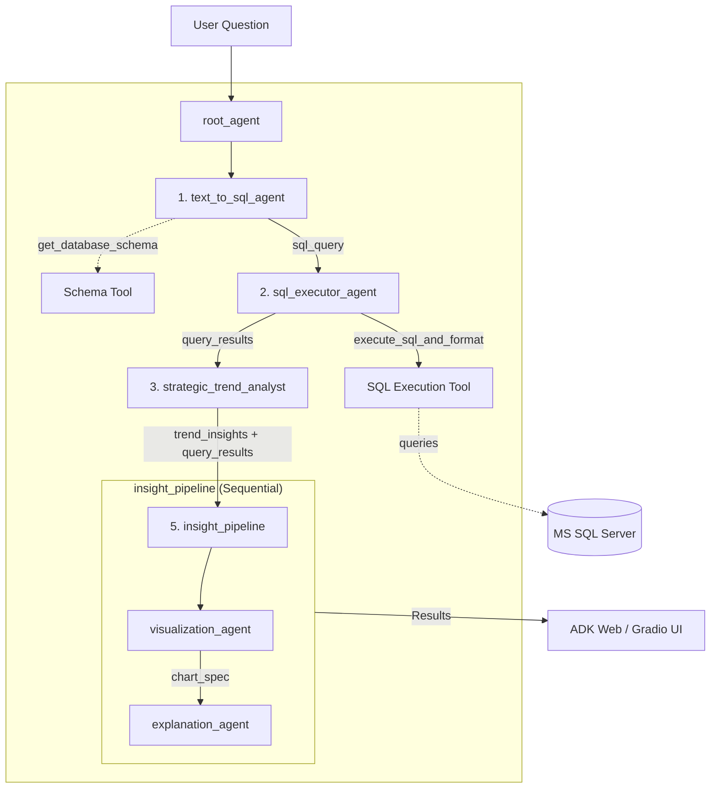

# GBI Business Intelligence Agent

An intelligent data analysis system for Global Bike Inc. (GBI) powered by Google ADK and Gemini LLM.

This project leverages a Multi-Agent Business Intelligence (BI) architecture to transform natural language queries into actionable business insights. It is built using the Google Agent Development Kit (ADK) to orchestrate a sophisticated sequential workflow.

---

## Key Features

- **Optimized Sequential Pipeline:** A streamlined 4-step process designed to minimize token consumption and reduce response latency.
- **Strategic Trend Analyst:** A specialized agent that analyzes raw JSON data to identify business trends and provide strategic recommendations.
- **Graceful Error Handling:** Robust error-trapping at the database and SQL syntax levels ensures a smooth user experience even when connections fail or queries are invalid.
- **Enterprise Reporting:** Supports professional data exports in both PDF (sanitized to remove LaTeX/Emoji errors) and CSV formats.
- **Advanced Security:** SQL Guardrails strictly enforce `SELECT`-only permissions, with sensitive credentials managed via secure `.env` files.

---

##  Architecture Overview


```mermaid
flowchart TD
    UQ[User Question]
    UQ --> root_agent[root_agent]

    subgraph Main[ ]
        root_agent --> text_to_sql["1. text_to_sql_agent"]
        text_to_sql -. get_database_schema .-> schema[Schema Tool]
        text_to_sql -- sql_query --> sql_exec["2. sql_executor_agent"]
        sql_exec -- execute_sql_and_format --> sqltool[SQL Execution Tool]
        sql_exec -- query_results --> analyst["3. strategic_trend_analyst"]
        analyst -- "trend_insights + query_results" --> pip

        subgraph pipeline_box["insight_pipeline (Sequential)"]
            direction TB
            pip["5. insight_pipeline"]
            pip --> viz[visualization_agent]
            viz -- chart_spec --> exp[explanation_agent]
        end
    end

    sqltool -. queries .-> mssql[(MS SQL Server)]
    pipeline_box -- Results --> ui[ADK Web / Gradio UI]
```

---

## System Architecture

The system utilizes a `SequentialAgent` structure, removing redundant formatting steps for maximum efficiency:

1. **Text-to-SQL Agent** — Maps natural language to accurate SQL queries based on the GBI database schema.
2. **SQL Executor Agent** — Executes queries securely through a dedicated tool with built-in error handling.
3. **Strategic Trend Analyst** — Extracts business insights and identifies performance patterns directly from raw data.
4. **Insight Pipeline:**
   - **Visualization Agent:** Generates interactive charts using Altair.
   - **Explanation Agent:** Translates technical results into 2–4 concise executive summary sentences.

---

## Project Structure

```
GBI-BI-Agent/
├── bi_agent/                # Core Agent Logic
│   ├── agent.py             # Optimized Multi-Agent Definitions
│   ├── tools.py             # DB Connectors & Export Logic
│   ├── __init__.py          # Package Export Configuration
│   └── .env.example         # Template for Credentials
├── app.py                   # Gradio Web UI with Export Features
├── pyproject.toml           # uv project management file
└── README.md                # Project Documentation
```

---

## ⚙️ Installation & Setup

This project uses `uv` for fast and reproducible Python environment management.

### 1. Prerequisites

- Python 3.12+
- ODBC Driver 18 for SQL Server
- Gemini API Key (from [Google AI Studio](https://aistudio.google.com))

### 2. Configuration

Rename `.env.example` to `.env` inside the `bi_agent/` folder and configure the following:

```env
GOOGLE_API_KEY=YOUR_KEY
MSSQL_SERVER=ADDRESS
MSSQL_DATABASE=DB_NAME
MSSQL_USERNAME=USER
MSSQL_PASSWORD=PASS
```

### 3. Execution

Run the application using the `uv` package manager:

```bash
uv run app.py
```

---

## 👥 Group 2 Members

| Name | Student ID |
|------|------------|
| Pawarit Pansing | 67070098 |
| Phuwit Saithong | 67070141 |
| Veekrit Owartsan | 67070168 |
| Suwijak Kulchatranon | 67070190 |
| Athibadee Buranakan | 67070195 |
| Charoensap Kaewsaengsuk | 67070212 |
| Piti Yang | 67070307 |

---

## 🧩 Technology Stack

| Technology | Role |
|------------|------|
| Google Agent Development Kit (ADK) | Multi-agent orchestration |
| Gemini Flash Lite | LLM backbone |
| Microsoft SQL Server | Data source |
| Gradio | Web UI |
| Altair | Data visualization |