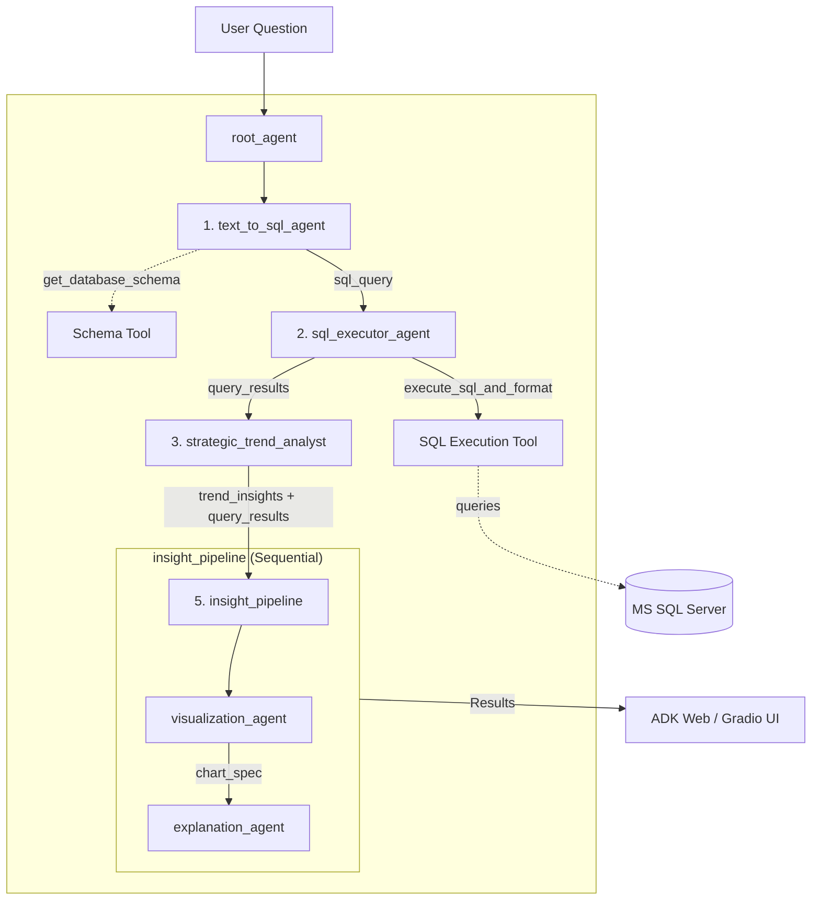

# GBI Business Intelligence Agent

An intelligent data analysis system for Global Bike Inc. (GBI) powered by Google ADK and Gemini LLM.

This project leverages a Multi-Agent Business Intelligence (BI) architecture to transform natural language queries into actionable business insights. It is built using the Google Agent Development Kit (ADK) to orchestrate a sophisticated sequential workflow.

---

## Key Features

- **Optimized Sequential Pipeline:** A streamlined 4-step process designed to minimize token consumption and reduce response latency.
- **Strategic Trend Analyst:** A specialized agent that analyzes raw JSON data to identify business trends and provide strategic recommendations.
- **Graceful Error Handling:** Robust error-trapping at the database and SQL syntax levels ensures a smooth user experience even when connections fail or queries are invalid.
- **Enterprise Reporting:** Supports professional data exports in both PDF (sanitized to remove LaTeX/Emoji errors) and CSV formats.
- **Advanced Security:** SQL Guardrails strictly enforce `SELECT`-only permissions, with sensitive credentials managed via secure `.env` files.

---

##  Architecture Overview


```mermaid
flowchart TD
    UQ[User Question]
    UQ --> root_agent[root_agent]

    subgraph Main[ ]
        root_agent --> text_to_sql["1. text_to_sql_agent"]
        text_to_sql -. get_database_schema .-> schema[Schema Tool]
        text_to_sql -- sql_query --> sql_exec["2. sql_executor_agent"]
        sql_exec -- execute_sql_and_format --> sqltool[SQL Execution Tool]
        sql_exec -- query_results --> analyst["3. strategic_trend_analyst"]
        analyst -- "trend_insights + query_results" --> pip

        subgraph pipeline_box["insight_pipeline (Sequential)"]
            direction TB
            pip["5. insight_pipeline"]
            pip --> viz[visualization_agent]
            viz -- chart_spec --> exp[explanation_agent]
        end
    end

    sqltool -. queries .-> mssql[(MS SQL Server)]
    pipeline_box -- Results --> ui[ADK Web / Gradio UI]
```

---

## System Architecture

The system utilizes a `SequentialAgent` structure, removing redundant formatting steps for maximum efficiency:

1. **Text-to-SQL Agent** — Maps natural language to accurate SQL queries based on the GBI database schema.
2. **SQL Executor Agent** — Executes queries securely through a dedicated tool with built-in error handling.
3. **Strategic Trend Analyst** — Extracts business insights and identifies performance patterns directly from raw data.
4. **Insight Pipeline:**
   - **Visualization Agent:** Generates interactive charts using Altair.
   - **Explanation Agent:** Translates technical results into 2–4 concise executive summary sentences.

---

## Project Structure

```
GBI-BI-Agent/
├── bi_agent/                    # Main agent package
│   ├── __init__.py              # Optimized package exports
│   ├── agent.py                 # Multi-agent definitions & COMPASS prompts
│   ├── tools.py                 # Database connectors & PDF/CSV export logic
│   ├── sql_executor.py          # SQL security validation
│   └── .env.example             # Template for API keys and credentials
├── app.py                       # Gradio web interface & export logic
├── pyproject.toml               # Dependency management (uv)
└── README.md                    # Documentation
```

---

##  Installation & Setup

This project uses `uv` for fast and reproducible Python environment management.

### 1. Prerequisites

> [!IMPORTANT]
> You need uv, a Gemini API key, and access to a SQL Server database.

### Required Software
- `uv` package manager - [Installation guide](https://github.com/kirenz/uv-setup)
- Python 3.12+
- ODBC Driver 18 for SQL Server

### API Access
- Free Gemini API key from [Google AI Studio](https://aistudio.google.com/prompts/new_chat)
- Microsoft SQL Server database access

### 2. Configuration

Go to folder bi_agent and rename `.example.env` to `.env` and fill in your credentials:

```env
# Google API Key
GOOGLE_API_KEY=your_gemini_api_key_here

# SQL Server Configuration
MSSQL_SERVER=your_server_address
MSSQL_DATABASE=your_database_name
MSSQL_USERNAME=your_username
MSSQL_PASSWORD=your_password
```

### 3. Execution

Run the application using the `uv` package manager:

```bash
uv run app.py
```

---
## Usage Guide

### Example Questions to Try

You can ask the GBI BI Agent a variety of business questions:

| Category | Example Question |
|----------|-----------------|
| Product Analysis | "What are the top 10 products by price?" |
| Category Insights | "Show me product categories and their average prices" |
| Filtering | "List all products in the Bikes category" |
| Aggregations | "How many products are there in each category?" |
| Trends | "Show monthly sales trends for 2023" |

---

### Running the Interfaces

The system supports **dual interfaces** using the same unified agent logic.

#### Option 1: ADK Web Interface
> Best for **debugging** and seeing how the AI "thinks".

```bash
uv run adk web
```

Then open: [http://127.0.0.1:8000](http://127.0.0.1:8000)

Select `bi_agent` to view the **execution trace**, tool calls, and state updates in real-time.

---

#### Option 2: Gradio Web Interface
> Best for **business users** and professional reporting.

```bash
uv run app.py
```

Then open: [http://127.0.0.1:7860](http://127.0.0.1:7860)

Enter your question and click **"Analyze Data"** to view:
- 🗄️ Generated SQL query
- 📊 Interactive data tables
- 📉 Altair charts
- 💼 Executive business insights

---
## 👥 Group 2 Members

| Name | Student ID |
|------|------------|
| Pawarit Pansing | 67070098 |
| Phuwit Saithong | 67070141 |
| Veekrit Owartsan | 67070168 |
| Suwijak Kulchatranon | 67070190 |
| Athibadee Buranakan | 67070195 |
| Charoensap Kaewsaengsuk | 67070212 |
| Piti Yang | 67070307 |

---

## 🧩 Technology Stack

| Technology | Role |
|------------|------|
| Google Agent Development Kit (ADK) | Multi-agent orchestration |
| Microsoft SQL Server | Data source |
| Gradio | Web UI |
| Altair | Data visualization |